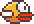

# Flappy Lab

> A browser playground for Flappy Bird, neural networks, and neuroevolution: train a population of birds or play a run yourself.

[](https://gsfranzoni.github.io/flappy-bird/)
[](https://vite.dev/)
[](https://react.dev/)
[](https://bun.sh/)

<p align="center">
  
</p>

[Live demo →](https://gsfranzoni.github.io/flappy-bird/)

Flappy Lab is a small Flappy Bird implementation with two ways to interact with the same simulation. In **Play**, one bird is controlled with the keyboard or a click. In **Training**, a population of neural-network controllers flies simultaneously and evolves from one generation to the next.

The project is deliberately split between the simulation and the genetic algorithm. The game engine owns birds, pipes, collisions, score, sounds, and fitness accumulation. `Evolution` owns only neural networks and fitness values: it selects elites, creates children through uniform crossover, mutates them, and produces the next generation.

Training progress is saved in localStorage. The persisted snapshot includes the generation, network parameters, population fitness values, and all-time fitness and score metrics; Zod validates it before the app restores anything.

## How it works

```text
Evolution population
  Individual { NeuralNetwork, fitness }
     │
     ▼
Training maps each network to a fresh Bird + Agent + NeuralController
     │
     ▼
GameEngine simulates pipes, decisions, collisions, score, and fitness
     │
     ├── all birds die
     └── score reaches the generation cap
     │
     ▼
Fitness results are assigned back to the matching individuals
     │
     ▼
Rank by fitness and retain the elite 10%
     │
     ▼
Uniform crossover: every network parameter comes from either parent
     │
     ▼
Mutation: each parameter may be perturbed
     │
     ▼
Next generation starts with fresh game agents
```

Each controller uses the same compact network architecture:

```text
bird position, vertical velocity, pipe distance, pipe gap
                         │
                         ▼
                     Linear 4 → 8
                         │
                         ▼
                       ReLU
                         │
                         ▼
                     Linear 8 → 1
                         │
                         ▼
                      Sigmoid
                         │
                         ▼
                    flap / no flap
```

The best 10% of a completed population are copied unchanged. Every remaining network is built from two selected elite parents: each weight or bias has a 50% chance of coming from either parent, then the configured mutation rate and amount are applied. Fitness is accumulated from survival time.

## What you can explore

- Play Flappy Bird with Space, ↑, or a click on the canvas.
- Watch 1,000 neural-network-controlled birds train in parallel.
- Adjust the simulation speed from 1× to MAX.
- Inspect live generation, population, fitness, score, and all-time metrics.
- See elitism, uniform crossover, and mutation create each new generation.
- Resume a validated local training snapshot after refreshing the page.
- Reset the training run and clear its saved progress.
- Inspect the pixel-art canvas renderer, scrolling floor, and slower parallax background.

## Improvements

- [ ] Let users configure a training run: population size, elite percentage, mutation rate, mutation amount, and neural-network layers.
- [ ] Add a richer best-fitness-by-generation history so training runs can be compared over time.
- [ ] Make saved runs exportable and importable for sharing experiments.

## Support

If you enjoyed this small neuroevolution experiment, you can support its creator here:

[](https://buymeacoffee.com/gsfranzoni)

<a href="https://buymeacoffee.com/gsfranzoni">
  
</a>

## Quick start

Requires [Bun](https://bun.sh/) 1.4 or newer.

```bash
bun install
bun run dev
```

Open the Vite URL printed in the terminal, usually [`http://localhost:5173`](http://localhost:5173).

To create a production build locally:

```bash
bun run build
```

## Commands

| Command             | Purpose                                   |
| ------------------- | ----------------------------------------- |
| `bun run dev`       | Start the Vite development server.        |
| `bun run build`     | Type-check and create a production build. |
| `bun run preview`   | Preview the production build locally.     |
| `bun run test`      | Run the Vitest unit-test suite.           |
| `bun run lint`      | Run Oxlint.                               |
| `bun run lint:fix`  | Apply available Oxlint fixes.             |
| `bun run fmt`       | Format source files with Oxfmt.           |
| `bun run fmt:check` | Check formatting without modifying files. |

> [!NOTE]
> Use `bun run test`, not `bun test`. The project test suite runs through Vitest; Bun's built-in test runner does not provide the Vitest globals used by the sound tests.

## Project structure

```text
src
├── components
│   └── game
│       ├── canvas.tsx       Responsive canvas, renderer setup, animation loop
│       ├── play.tsx         Human-controlled game route
│       └── training.tsx     Training simulation, telemetry, and controls
├── core
│   ├── ai
│   │   ├── evolution.ts     Population, selection, crossover, and mutation
│   │   ├── network.ts       Small neural-network implementation
│   │   └── progress.ts      Zod-validated localStorage training snapshots
│   └── game
│       ├── engine.ts        Pipes, collisions, scoring, and fitness updates
│       ├── renderer.ts      Pixel-art canvas rendering and parallax motion
│       ├── agent.ts         Bird/controller fitness wrapper
│       ├── ai.ts            Neural-network controller
│       └── human.ts         Keyboard/click controller
├── routes
│   ├── training.tsx         Training route
│   └── play.tsx             Play route
└── hooks
    └── use-animation-frame.ts
        Animation-frame scheduling
```

Tests live next to the modules they cover. They exercise the neural-network primitives, evolution behavior, game engine, controllers, collisions, sound wrapper, and agents.
